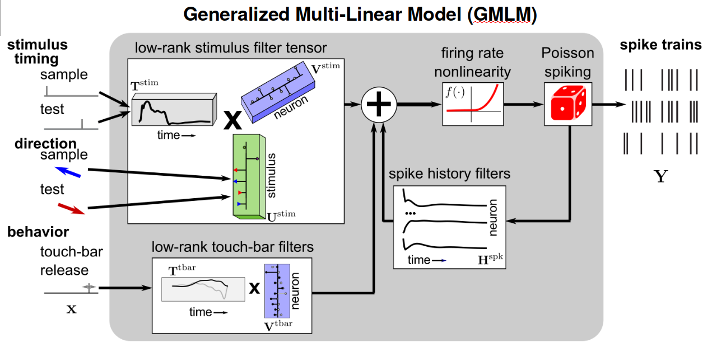

# GMLM_dmc
Generalized multilinear model for dimensionality reduction of neural population spike trains.
While this code is intended for modeling responses during decision-making tasks, it could be used more broadly for tensor regression.
Currently, the code primarily supports the Poisson likelihood to model spike count observations, but a squared error option is also included.
The main GMLM class can work with simultaneously or independently recorded neurons. The example scripts currently only show the setup for the individual recording configuration.
Model fitting runs best on GPUs, but an okay set of host code is now included.

The core of the code is a C++/CUDA library with optimized log likelihood and derivative computations.
This code requires a CUDA capable GPU (toolkit v11.3+).
Currently, only a MATLAB interface is given, but it's possible I'll get around to adding a Python interface.
While I could get the model working in PyTorch or Tensorflow, running inference like HMC needed all the performance I could get. That's why it's in CUDA with a bunch of initial data structure setup.

MATLAB visualizations in the example GMLM use Tensor Toolbox (http://tensortoolbox.org/).
Tensor toolbox should be added to the MATLAB path.

An example dataset and code is given for a macaque performing delayed-match-to-category (DMC) task.

Code tested using:
CUDA 11.3-6
MATLAB R2020/21a
TensorToolbox 3.1

# Python Version

A Python version of the GMLM code can be found in this related repository: **[https://github.com/latimerk/pyNeuroGMLM](https://github.com/latimerk/pyNeuroGMLM)**.
The underlying CUDA/GPU code is the same.

## Citation
```
Latimer, K. W., & Freedman, D. J. (2023). Low-dimensional encoding of decisions in parietal cortex reflects long-term training history. *Nature Communications*.
```
https://www.nature.com/articles/s41467-023-36554-5

# Regression-based dimensionality reduction for analyzing neural populations

The development of the GMLM for dimensionality reduction of neural population recordings was motivated by our desire to disentangle bottom-up (stimulus driven) and top-down (cognitive) signals in neural datasets to compare how parietal cortex responses during a task differed across animals with distinct long-term training histories.
In our paper, we analyzed populations of neurons recorded from macaque monkeys performing a delayed-match-to-category task.
On each trial in this task, the animal fixated and then was presented with a random-dot motion stimulus (the sample stimulus) moving in one of eight possible directions.
After a delay period, the animal viewed a second motion stimulus (test stimulus).
The animal was tasked to decide whether or not the motion stimuli belonged to the same category (red or blue directions).
If the category was the same, the monkey released a touch bar to receive a reward. Otherwise, the monkey needed to continue to hold the touch bar.


Previous studies have shown that LIP neurons reflect the motion direction categories.
However, rigorously decomposing neural responses to the task features is not necessarily simple: motion direction and category are tightly correlated.
Additionally, the touch-bar release occurs at different times on different trials.
We therefore used a model-based dimensionality reduction approach so that we could describe LIP encoding using shared response features across the population.
Moreover, the sample and test stimulus ought to share similar bottom-up stimulus drive, but category-related activiy could differ in these peroids because of the different requirements placed on the two simulus presentation.

## Analyzing many neurons recorded in an experiment

Classic approaches to analyzing neural data often involve taking the average firing rate of neurons across relative to a specific variable.
These peri-stimulus time histograms (PSTHs) can show how the average firing rate depends on a task variable in each neuron.
The task the animal performs may have many different variable combinations and variable task timing (in the case of the categorization task, the animal determines when the trial ends).
As a result, there are many conditional firing rates that may be computed relative to different task events.
Summarizing a collection of PSTHs (like the ones below) into actionable results can therefore be difficult.


## Generalized linear point-process models for single neurons

The generalized linear model (GLM) is frequently used as the framework describing how different variables (stimulus, behavior, etc.) contribute to a neuron's firing.
Given a specific parameterization of the experiment, the firing rate of cell given as a linear function of these variables followed by a rectifying nonlinearity (often, the exponential function).
Spikes are then modeled as a Poisson process given that rate.
The model often includes an *autogressive* term: past spikes affect the probability of spiking again. This "spike history" component can account for properties such as bursting or the refractory period.

The key in applying these models is chosing an appropriate parameterization of the experimental variables.
For modeling retinal ganglion cells in response to a visual stimulus, the variables may consist of the luminance values of the past T frames shown on the screen. The models coefficients then represent a linear filtering of the visual stimulus over time.
For a decision making task, a specific part of the task (for example, a "go" signal) may be represented as a delta function at the time of onset. The coefficients can then be a linear filter for that signal. Note that this example parameterization is equivalent to finding a nonlinear function within a generalized additive model framework where the function is over time.

For example, a single neuron in the categorization task modeled as a GLM could be diagramed as follows:


The GLM overcomes some of the problems with computing raw PSTHs for each cell by introducing a set of (hopefully reasonable) constraints.
The model can be appied to trials of various lengths and task timings.
Task structure, like consistent stimulus-dependent responses to repeated stimulus presentations, can be incorporated.
However, one must still summarize the results of fitting GLMs to each cell individually.
Considering the entire population may also increase power by seeking common response features across neurons.

## GMLMs and dimensionality reduction

Fitting GLMs to each cell in our population of neurons during the categorization task requires fitting a linear filter (coefficients) over time for each motion stimulus direction for each neuron.
We can place these filters into a 3-way matrix or tensor.
We then assumed that we could approximate the population's response with a tensor decomposition of these filters: that is the sum of components that are made up of a single filter and weights for each stimulus direction and neuron (a CP decomposition).
This way we end up with fewer parameters and a single model for the population,


Plugging this idea into the our model diagram, we have a tensor-factorized version of our linear model of the neurons responding during the task:

We can fit these low-rank set of parameters within the Poisson likelihood framework of the GLM, giving us a dimensionality-reduced model fit directly to the data.

Like the GLM, this model can cope with trials of various lengths and include task information directly into the model (trickier for some dimensionality reduction methods like PCA and its varients).

## Quantifying population responses with the GMLM

Fitting the model to data isn't our ultimate goal: we wished to quantify response properties of neural populations.

First, we performed rank and variable selection in our model.
We increased the number of components and the amount of stimulus information (e.g., only considering category or adding specirfic motion direction) to see how many components we needed and how much each piece of information mattered.
Here, the log-likelihood is shown relative to a baseline model with only a mean firing rate and the GMLM is compared to the GLM fits (the full-rank model).


In this low dimensional model, we could plot the trajectories of the response to the sample stimulus over time in the population.
In monkey H, we found strong motion-direction tuning that resembled the true motion directions. Category tuning was sustained through the delay period and orthogonal to the motion-direction dependent response. The orthogonalization suggests that direction and cateogory information may be separated in LIP despite being correlated.

Other animals with different training experiences showed different population tuning that more strongly encoded category:


We also performed model comparison to test quantitatively how motion was encoded by the population.
We tested models that assumed motion-tuned responses could be parameterized as with sine and cosine of the direction, or if more flexible tuning was needed.
This comparison found that a simplified cosine/sine tuning model was all that was needed.
Next, we tested if motion tuning was consistent across the sample and test stimulus presentations: a model that assumed the tuning was the same to both stimulus presentations was just as good as the more complex model with distinct tuning.

In contast, category tuning was not the same during the sample and test stimuli. The low-dimensional test response does not show the sustained category response seen above during the sample stimulus:


These results together show that we can quantify direction and category tuning in the populations with the GMLM, using a cosine-tuning model for the stimulus response that is constrained to the be consistent to both sample and test stimuli.
We used this model to quantify the strength of direction and category tuning the model as vector lengths in the low-dimensional response space.
The cosine direction tuning model encodes stimulus directions on an ellipse, which has a major and minor axis.
Unequal major and minor axis tuning can be consistent with a feed-forward categorization computation, while equal major and minor axes indicated even tuning of all motion directions. 

In the above example, monkey H shows more even direction tuning and a slow emergence of categorical tuning while monkey J shows a quick encoding of category in LIP.

## Single-trial dynamics: low-rank autoregressive dynamics

The previous results focused on the mean rate of LIP responses in the categorization task.
The model, however, can consider single trial spiking responses.

As discussed earlier, the GLM included an autoregressive spike history term. Past spikes are filtered and added to the instaneous rate:


To see how this impacts the model's firing rate on a single trial, we can see how the stimulus-dependt tuning is added to the filtered spike history:


The GLM typically assumes the spike history is fixed.
This is a reasonable assumption in, for example, retinal ganglion cells during white noise stimulation because the cells are in a steady-state response.
However, in this partial cortex dataset, the dynamics during the stimulus presentation and the working-memory (delay) period could be very different.
Thus, we wanted to allow the autogressive effect to change during the trial.
In the strict GLM framework, this would be extremely difficult: estimating a spike history filter for each time point in the trial adds an absurd number of parameters.
We also don't know a prior excactly when the dynamics change.
Therefore, we included a low-rank tensor decompostion of the changing spike history effects over time:


In addition to the static spike history, a low-rank component that was weights (or a filter) relative to the stimulus onset time, weights for each neuron (and possibly stimulus consition), and a spike history filter is included. This allows a low-rank change in spike history through the trial.
To see the effect of including this term on the estimated firing rate of the example trial above:


The dyanimic spike history picks out more rhythmic activity during the working memory period.

The estimated parameters/filters for monkeys H and J are shown below:

We find both a different in the amount of oscillatory dynamic spike history (top row: monkey J has it, monkey H does not show an additional ossicilatory component) and the timing onset (monkey J transitions in dynamics before the stimulus offset).

The effective average spike history filters in the populations we analyzed during the stimulus and working memory periods are:


The low-rank approach was essential for finging and visualizing these effects in a practical way.

## GMLM
The GMLM aided us in summarizing the population responses during the categorization task.
We could disentangle and quantify category and direction responses.
Additionally, we found autoregressive dynamics that suggest differences in learned working memory strategies between animals.
All this took place within a single modeling framework.